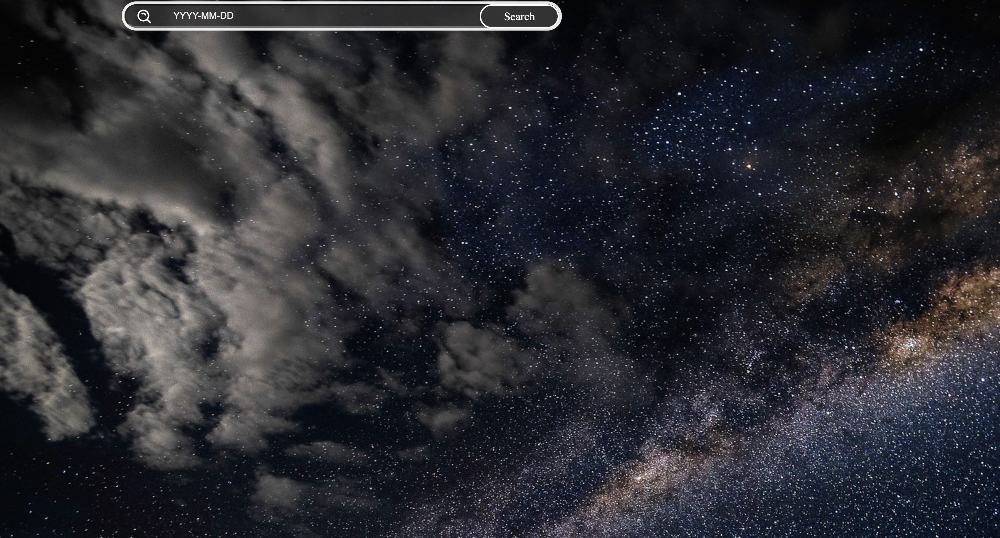

<div id="top"></div>
<!--
*** Thanks for checking out the Best-README-Template. If you have a suggestion
*** that would make this better, please fork the repo and create a pull request
*** or simply open an issue with the tag "enhancement".
*** Don't forget to give the project a star!
*** Thanks again! Now go create something AMAZING! :D
-->


<!-- PROJECT SHIELDS -->
<!--
*** I'm using markdown "reference style" links for readability.
*** Reference links are enclosed in brackets [ ] instead of parentheses ( ).
*** See the bottom of this document for the declaration of the reference variables
*** for contributors-url, forks-url, etc. This is an optional, concise syntax you may use.
*** https://www.markdownguide.org/basic-syntax/#reference-style-links
-->


<!-- PROJECT LOGO -->
<br />
<div align="center">
  <a href="https://github.com/Jacob-Heinrich/nasaAPOD">
  </a>

<h3 align="center">NASA APOD search</h3>

  <p align="center">
    React application to search through NASA's astronomy picture of the day by YYYY-MM-DD.
    <br />
    <a href="https://github.com/Jacob-Heinrich/nasaAPOD"><strong>Explore the docs »</strong></a>
    <br />
    <br />
    <a href="https://nasa-apod-alpha.vercel.app">View Demo</a>
    ·
    <a href="https://github.com/Jacob-Heinrich/nasaAPOD/issues">Report Bug</a>
    ·
    <a href="https://github.com/Jacob-Heinrich/nasaAPOD/issues">Request Feature</a>
  </p>
</div>


<!-- TABLE OF CONTENTS -->
<details>
  <summary>Table of Contents</summary>
  <ol>
    <li>
      <a href="#about-the-project">About The Project</a>
      <ul>
        <li><a href="#built-with">Built With</a></li>
      </ul>
    </li>
    <li>
      <a href="#getting-started">Getting Started</a>
      <ul>
        <li><a href="#prerequisites">Prerequisites</a></li>
        <li><a href="#installation">Installation</a></li>
      </ul>
    </li>
    <li><a href="#contact">Contact</a></li>
  </ol>
</details>


<!-- ABOUT THE PROJECT -->
## About The Project



<p align="right">(<a href="#top">back to top</a>)</p>


### Built With

* [React.js](https://reactjs.org/)


<p align="right">(<a href="#top">back to top</a>)</p>


<!-- GETTING STARTED -->
## Getting Started


### Prerequisites

This is an example of how to list things you need to use the software and how to install them.
* npm
  ```sh
  npm install npm@latest -g
  ```

### Installation

1. Clone the repo
   ```sh
   git clone https://github.com/Jacob-Heinrich/nasaAPOD
   ```

2. Install NPM packages
   ```sh
   npm install
   ```


<p align="right">(<a href="#top">back to top</a>)</p>


<!-- CONTACT -->
## Contact

Your Name - Jacob Heinich - jacob.heinrich09@gmail.com

Project Link: https://nasa-apod-alpha.vercel.app

<p align="right">(<a href="#top">back to top</a>)</p>
# nasaAPOD
